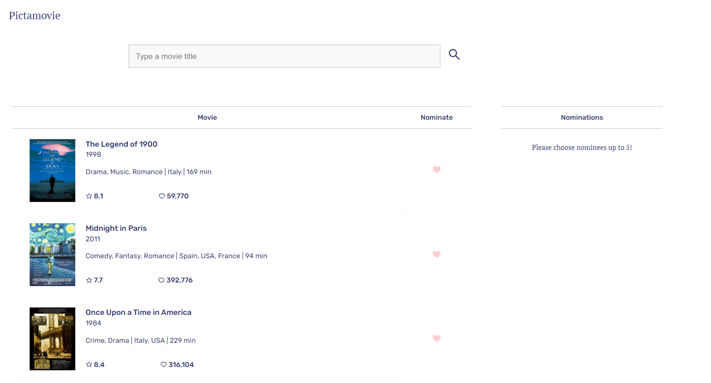
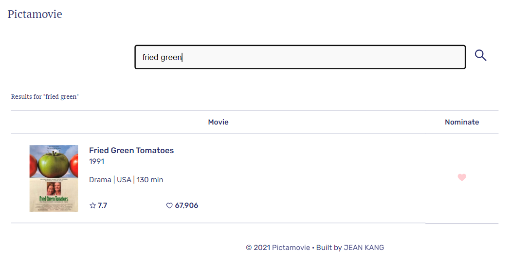

## 📑 PROJECT

A webpage that can search OMDB for movies, and allow the user to save their favourite films

https://pikamovie.netlify.app/ (in progress)

---

## ✏️ WIREFRAMING

---

## 🎨 UI

#### - MAIN

---

#### - SEARCH

---

#### - MODAL

---

#### - MODAL (custom image for empty posters)

   
  
---

## 🔮 FEATURE

Search OMDB and display the results (movies only)
Add a movie from the search results to our nomination list
View the list of films already nominated
Remove a nominee from the nomination list

---

## 📎 PLAN

#### STACK

React, HTML, CSS, Heroku

#### STEP

- Search results come from OMDB's API
- Each search result lists information of the movie (title, year of release and a button to nominate that film)
- Updates to the search terms updates the result list
- Movies in search results can be added and removed from the nomination list
- If a search result has already been nominated, disable its nominate button
- Display a banner when the user has 5 nominations

---

## 💡 PROBLEM SOLVING RECORD

- [x] The main page is empty ((before the user searches any movie)  
       => Display pre-loaded movie list

- [x] Some movie data has no posters, and N/A values  
       => Replace empty posters with custom poster, and error messages

- [x] Scroll bar relocates the elements  
       => Set width: 100% and margin: auto 0

- [x] Input text limit  
       => Set input maxLength

- [x] heroku error  
       => free deployment limit exceeded  
       => deploy on netlify  
       yarn build  
       netlify deploy  
       netlify deploy --prod

- [x] github push rejected after adding README file on Github  
       => git pull origin master

- [x] how to import images in public folder in react?

      
      

- [x] API key privacy issue
      => saved it in .env file

- [x] using multiple dynamic className  
       => [styles.description, styles.hr].join(' ')]  
       => [`${styles, description}, ${styles.hr}`]
- [x] how to make tables responsive?  
       => flex: 1 1 70% / flex: 1 1 30% (display: flex, width: 100% for its parents & max-width: fixed value(px) for its grand parents)
